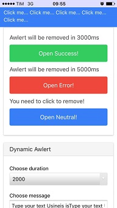
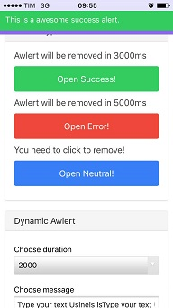
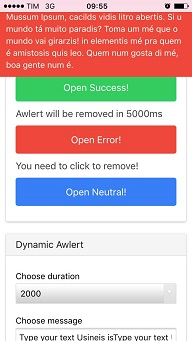

# Awlert

**Aw**esome A**lert**s for Ionic 1.x 


 


## Table of Contents

- [Demo](#demo)
- [Setup](#setup)
- [Usage](#usage)
- [Example](#example)

---

## Demo

- Ionic View
  + You can download on [Ionic View](http://view.ionic.io/) using the appId: `7f2e70fa`
  
- Clone repository
    + Clone this repo and in `/demo` folder, then run `ionic serve`:

---

## Setup

### Install

    `bower install awlert`

### Import JS/CSS Files

```
    <link rel="stylesheet" href="lib/awlert/dist/css/awlert.css">
    <script src="lib/awlert/dist/awlert.min.js"></script>
```

### Inject awlert module

```
    angular.module('myApp', ['ionic', 'awlert'])
```

---

## Usage

### awlert

You will use that service for create alerts in your controller.

`awlert` has 3 methods with the same params (message, duration).

>Ps. If you use duration = 1, the awlert will not leave.

|  Method  | Color      |
|:---------|------------|
| error    | assertive  |
| neutral  | positive   |
| success  | balanced   |

#### Click event

You can handle with click event, you can see in this [example](#click-example).

---

## Examples

### Basic Example
```
    awlert.neutral('Awesome neutral message for your user', 1000);
    awlert.error('Awesome error message for your user', 2000);
    awlert.success('Awesome success message for your user', 1000);
```

### Click Example

```
    var neutralAwlert = awlert.neutral('User need click to remove it', -1);

    neutralAwlert.$on('awlert:click', function(evt, aw){
        //Do awesome stuffs

        //Then, for close use:
         aw.remove();
         // or
         // neutralAwlert.remove();
    });
```

---

### Help this project

If you have some problem or want to suggest more features, please, create an issue for report. You would like to help us? fork then pull refresh!!!

If you want contact me: 

- jouderianjr@gmail.com
- [@jouderianjr](http://www.twitter.com/jouderianjr)